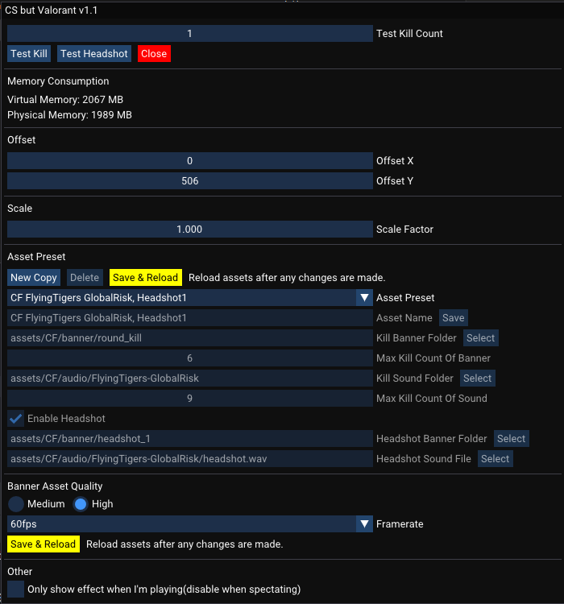

# CS but ...
CS-but-XXX is program that allows you to enjoy kill effects from other games when playing Counter Strike.




## How to Build
The project can be built with CMake on Windows. All the vendor libraries are included in the project.
```
mkdir build
cd build
cmake ..
make    # or other build tool
```

## How it works
The program is composed of three parts:
- Http Server that collects game state info with [Counter-Strike: Global Offensive Game State Integration](https://developer.valvesoftware.com/wiki/Counter-Strike:_Global_Offensive_Game_State_Integration)
- A transparent and always-on-top overlay that shows sequence of kill effect images.
- A settings window for players to customize and tweak.

As you can see, the program is non-invasive, and will never cause VAC.

Currently, all the assets(2k120fps/2k60fps/1080p120fps/1080p60fps) will be loaded into memory, which will ocupy larger memory as the assets quality and frames get higher. Memory consumption improvements
will come in the future(by change loading method or by loading the texture into GPU).

## To Do
- [x] add volume control.

- [x] add size control.

- [x] improve memory consumption.

- [x] offer more quality level.

- [ ] add more effects of different games.

## Third Party Libraries
- [cpp-httplib](https://github.com/yhirose/cpp-httplib)
- [GLFW](https://github.com/glfw/glfw)
- [glm](https://github.com/g-truc/glm)
- [ImGui](https://github.com/ocornut/imgui)
- [jsoncpp](https://github.com/open-source-parsers/jsoncpp)
- [soloud](https://github.com/jarikomppa/soloud)
- [spdlog](https://github.com/gabime/spdlog)
- [stb_image](https://github.com/nothings/stb)
